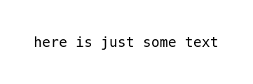
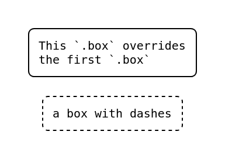
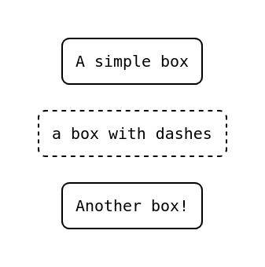
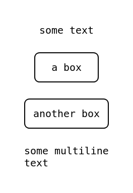
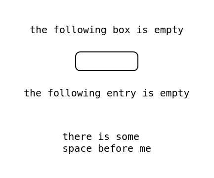
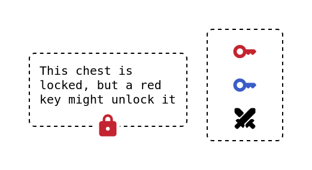

# yaml2diagram


`yaml2diagram` builds pretty diagrams declared in YAML, into html files

## Usage

Assuming that `input.yml` is a YAML file using the `yaml2diagram` syntax to
represent the desired diagram, convert this diagram into an html file
`output.html` with

```bash
yaml2diagram input.yml output.html
```

to convert the `input.yml` file to a diagram into `output.html`

## File Syntax

The source files for `yaml2diagram` are YAML files consisting of a YAML
dictionary with a single entry called `diagram` (eventually with modifiers, see
the [diagram root section](#diagram-root)). The `diagram` entry is a container
which contains the whole diagram.

```yaml
# empty-diagram.yml

diagram:
    # insert diagram here
```

The diagram is composed of:

-   values (YAML strings and numbers)
-   containers (single-entry YAML dictionaries) which can be styled
-   lists of values and containers (YAML lists)

The usage of these components is explained more in depth in the following
sections

### Values

A value is simply a string or a numeric value, and they can be used either as
contents of containers or as entries of lists.

Values are rendered as simple text inside a `<pre></pre>` tag to preserve line
breaks. Values are unstyled and they inherit the style of the closest container
ancestor. To style a value, you must put it inside a container and style the
container.

Examples of values are

```yaml
"text inside quotation marks is a valid value"
text outside quotation marks is also a valid value
1234567890 # a valid value
```

To enter multiline strings, you can use the `|` YAML syntax (which preservers
line breaks. There are other solutions if you don't want line breaks. See
[YAML official documentation](https://yaml.org/spec/1.2.2/#23-scalars))

A diagram consisting of only a single string can be expressed as the following

<table>
<tr>
<td>
    
```yaml
# just-text-diagram.yml

diagram: here is just some text

````

</td>
<td>



</td>
</tr>
</table>

### Containers

Containers are YAML dictionaries with a single entry, composed of a key and some
content. A container can be styled by adding classes and attributes to its key
(refer to the [keys section](#container-keys) to understand how to properly use
container keys and how to style them).

Here is an example where the diagram is composed of a single styled container,
in the shape of a box, containing a string


<table>
<tr>
<td>

```yaml
# just-a-box-diagram.yml

diagram:
    .box: some text

````

</td>
<td>


</td>
</tr>
</table>

> [!WARNING]  
> As far as YAML is concerned, in the previous example `.box` is just one of the
> possibly multiple entries of the dictionary `diagram`.
>
> Intuitively, it would make sense for multiple entries to be displayed as
> separate containers one after the other at the same level. Indeed,
> `yaml2diagram` does display them as such, but it is not recommended since this
> doesn't allow for multiple entries with the same key at the same level.
>
> The correct way to display multiple containers is to use a list (see the
> [lists](#lists) section). If multiple entries are given, `yaml2diagram` will
> display them as if they were separate containers inside a list, but a warning
> will be given

<table>
<tr>
<td>

This won't do what you'd think

```yaml
# valid-YAML-but-not-recommended-container-syntax.yml

diagram:
    .box: |
        This box won't be
        rendered because it's
        overwritten by the
        last entry of `diagram`
    .box.dashed: a box with dashes
    .box: |
        This `.box` overrides
        the first `.box`

# This has the same result as:
# diagram:
#     .box.dashed: a box with dashes
#     .box: |
#         This `.box` overrides
#         the first `.box`

```

</td>
<td>



</td>
</tr>
<tr>
<td>

This is how you should list containers

```yaml
# recommended-containers-syntax.yml

diagram:
    - .box: A simple box
    - .box.dashed: a box with dashes
    - .box: Another box!
```

</td>
<td>



</td>
</tr>
</table>

#### Special containers

Some containers (denoted by special classes) are special, and are rendered in
custom ways. Some examples of special containers are arrows, which by default
are just containers but on render are treated differently from other containers.
Other special containers are icons.

A list of all the special classes is given in the
[special classes section](#special-classes)

### Lists

Lists are YAML lists and can be used to display multiple values and containers
inside a container.

<table>
<tr>
<td>

```yaml
# list-example-diagram.yml

diagram:
    - just text
    - .box: and a container
    - .box: |
          and another container
          with the same key!
    - and other text
```

</td>
<td>


</td>
</tr>
</table>

> [!WARNING] While not suggested, entries of a list could also be lists
> themselves.
>
> The effect of doing this is that `yaml2diagram` will just flatten the list and
> raise a warning. It is not suggested to use nested lists (unless when using
> intermediate containers)

<table>
<tr>
<td>

This style is not suggested as it is pointless

```yaml
# nested-lists-are-not-suggested.yml

diagram:
    - some text
    - - .box: a box
      - .box: another box
    - |
        some multiline
        text

# This gives the same result as the following
# (which is the suggested syntax):
# diagram:
#     - some text
#     - .box: a box
#     - .box: another box
#     - other text
```

</td>
<td>



</td>
</tr>
<tr>
<td>

Of course, nested lists are available when there are intermediate containers

```yaml
# these-nested-lists-are-ok.yml

diagram:
    - |
        There is a list
        somewhere inside
        this list but this
        is ok!
    - .box:
          - many contents!
          - .box: some styled
          - some not
    - this is fine!
```

</td>
<td>


</td>
</tr>
</table>

### Empties

The content of a container or an entry of a list can be left completely empty,
as in the following example

<table>
<tr>
<td>

```yaml
# diagram-with-empties.yml

diagram:
    - the following box is empty
    - .box:
    - the following entry is empty
    -
    - |
        there is some
        space before me
```

</td>
<td>



</td>
</tr>
</table>

Empty containers can be used to draw some content-less containers in the
diagram, and empty entries in a list can be used to space around objects in the
diagram.

### Container Keys

As explained in the [container section](#containers), a container is composed of
a (single) key and a value. The container key is used to style the container.

A key is composed of an `id`, some `classes` and some `attributes`. In most
cases, these map 1:1 to html DOMs.

Keys are formatted as follows:

A key can have at most one `id`, while it can have as many (or as few) `classes`
and `attributes` as one whishes.

None of the components of a key (`id`, `classes` and `attributes`) is required:
a key could be only an `id` (eg `diagram`), only a `class` (eg `.box`), only an
attribute (eg `&label=server`) or completely empty (read note below).

> [!NOTE] An empty key would be effectively equal to some unstyled value, and
> while technically possible to have a container without any id, class nor
> attribute (for example with the key `.`), it is suggested to just use a simple
> value

```
ID.CLASS1.CLASS2.CLASSn&ATTR1=VAL1&ATTR2=VAL2&ATTRn=VALn
```

A comprehensive list of all the classes, special classes and attributes is given
in the respective sections

Some examples of keys are

```
diagram
.folder
.box.dashed&label=homelab
diagram.col-2
.icon.abs
&label=server
```

### Diagram root

The `diagram` object is the root of the diagram and contains every object that
gets displayed. Its `id` MUST be exactly `diagram`, but it can have class
modifiers. These class modifiers are special and work only on the `diagram`
object.

Without any class modifier, `diagram` displays as a list of its content from top
to bottom, that is it uses `display: flex` with `flex-direction: column`

The currently supported class modifiers are:

| Class                   | Effect                                                                                                             | CSS                                                    |
| ----------------------- | ------------------------------------------------------------------------------------------------------------------ | ------------------------------------------------------ |
| `.row`                  | makes `diagram` display from left to right instead of top to bottom                                                | `flex-direction: row`                                  |
| `.col-1`, ..., `.col-8` | makes `diagram` display as a grid with `n` columns, instead of a list, where `n` refers to the number in the class | `display: grid; grid-template-columns: repeat(n, 1fr)` |

### Classes

Classes for regular objects are divided in containers, modifiers and
meta-classes.

A container class specifies the overall shape of object it applies to. The
container classes are:

| Class     | Shape                            |
| --------- | -------------------------------- |
| `.box`    | a rectangle with rounded corners |
| `.folder` | a folder                         |

Next, modifier classes modify the appearence of the object, either of the
container or of its content. The modifier classes are:

| Class                                | Effect                                                                                                                                                                  |
| ------------------------------------ | ----------------------------------------------------------------------------------------------------------------------------------------------------------------------- |
| `.row`                               | display the contents of the container in a row instad of a column                                                                                                       |
| `.dashed`                            | makes the border of the container dotted instead of solid                                                                                                               |
| `.skew`                              | skews the container (`.box` becomes a parallelogram)                                                                                                                    |
| `.<color>`                           | makes the container and its content of color `<color>`, where `<color>` can be chosen between: `red`, `orange`, `yellow`, `green`, `light-blue`, `blue`, `purple`       |
| `.b-<color>`                         | makes the container (but not its content) of color `<color>`, where `<color>` can be chosen between: `red`, `orange`, `yellow`, `green`, `light-blue`, `blue`, `purple` |
| `.t-<color>`                         | makes the content (but not the container) of color `<color>`, where `<color>` can be chosen between: `red`, `orange`, `yellow`, `green`, `light-blue`, `blue`, `purple` |
| `.abs`                               | position the container absolutely relative to its parent, by default centered vertically and horizontally                                                               |
| `.top`, `.bottom`, `.left`, `.right` | when in combination with `.abs`, aligns the container respectively to the top, bottom, left and right. Can be used in combination with eachother                        |

### Special classes

#### Icons

The `.icon` class is used to draw Material Icons in the diagram. An `.icon`
object MUST contain only a string, which will be converted to the corresponding
Material Icon.

All the `.<color>` modifier classes work on icons.

<table>
<tr>
<td>

```yaml
# diagram-with-icons.yml

diagram.row:
    - .box.dashed&label=chest:
          - |
              This chest is
              locked, but a red
              key might unlock it
          -
          - .icon.abs.bottom.red: lock
    - .box.dashed:
          - .icon.red: key
          - .icon.blue: key
          - .icon: swords
```

</td>
<td>



</td>
</tr>
</table>

### Attributes

Here is a list of supported attributes:

| Attribute | Effect                                                      |
| --------- | ----------------------------------------------------------- |
| `label`   | displays the label above the container, aligned to the left |

### Links

Links don't currently work

## TODO

-   Add puppeteer to automatically get an image instead of an html file

## Developement

<details>

<summary>Developement tips</summary>

For a quick and dirty hot-reload developement, add the following tag to the
index.html head:

```html
<meta http-equiv="refresh" content="1" />
```

And then run the following command

```bash
ls -A1 | grep -v 'index.local.html' | entr -r bash -c './yaml2diagram diagram.local.yml index.local.html'
```

This is really a terrible way to do this, but it works and it doesn't require
any fancy setup (except having installed entr I guess)

</details>
